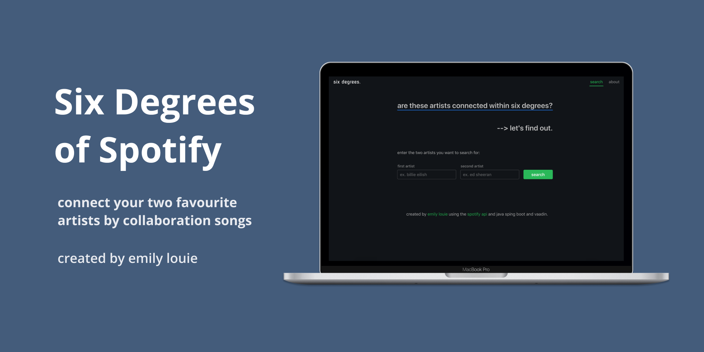
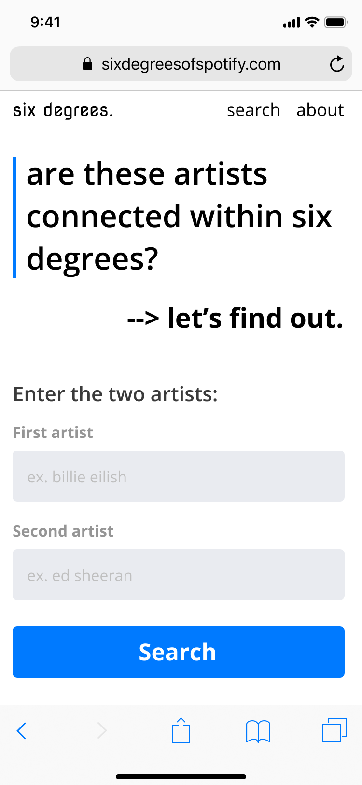
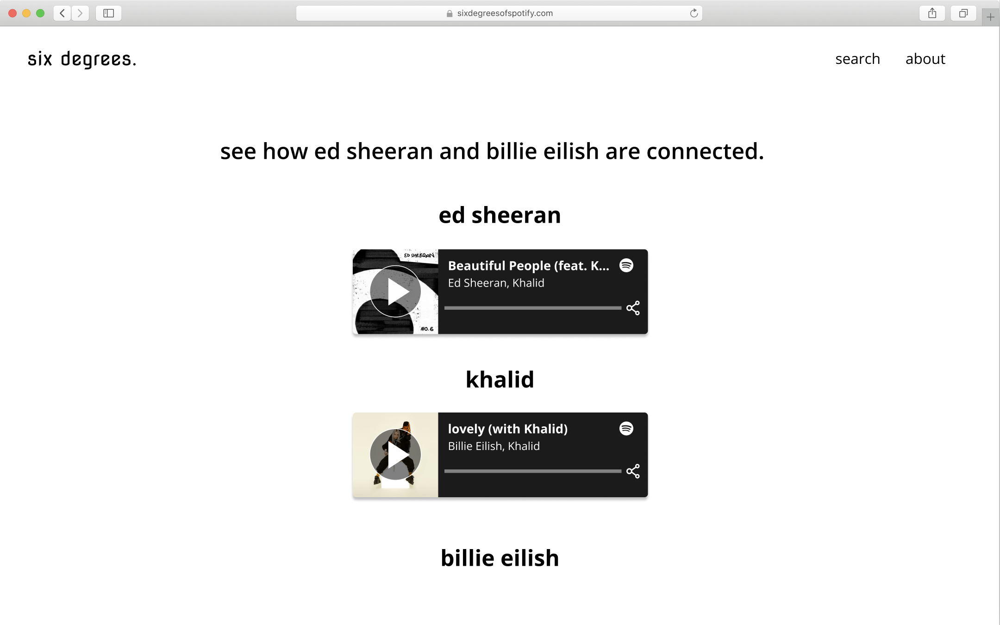
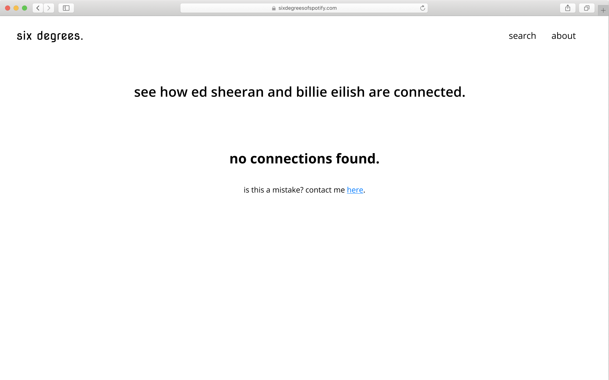
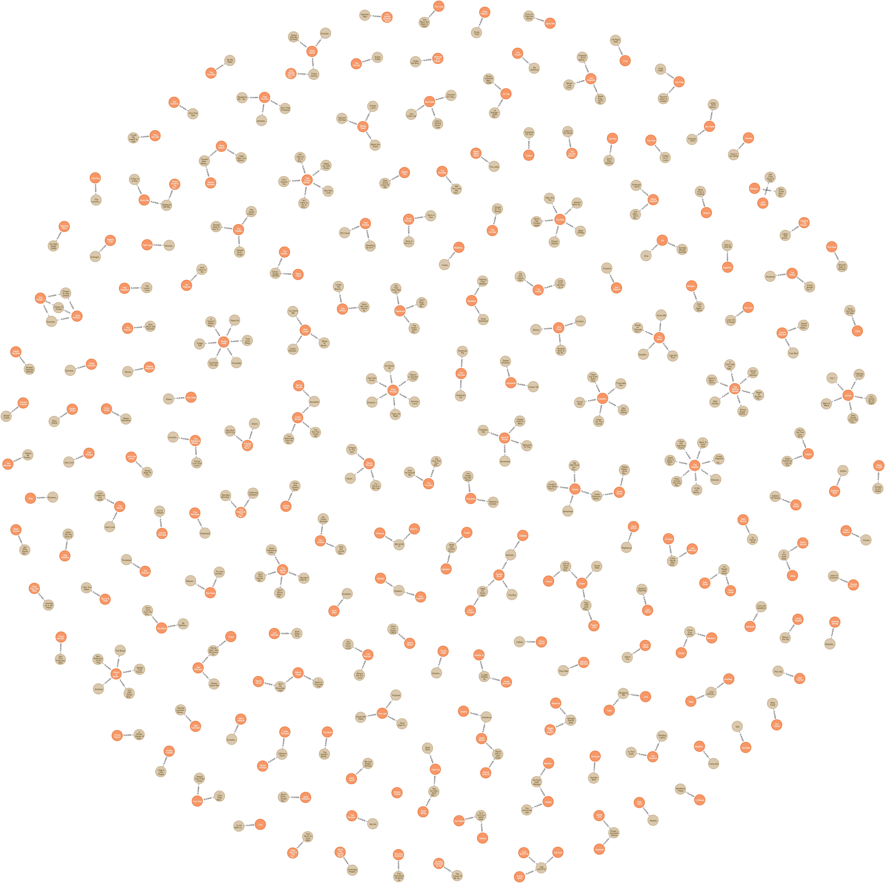
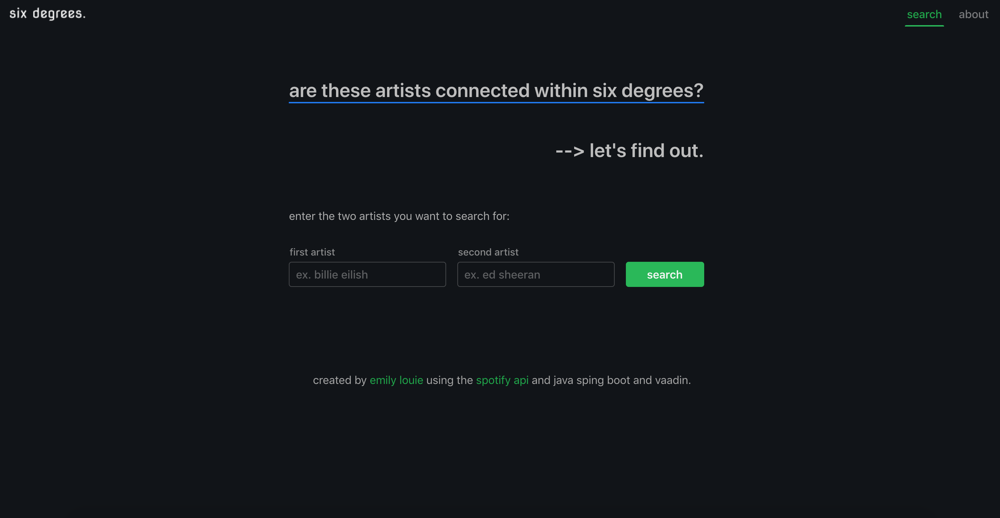
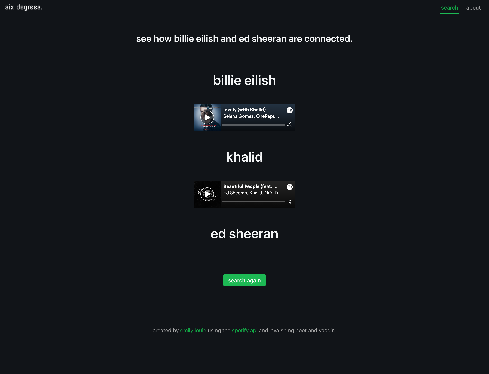
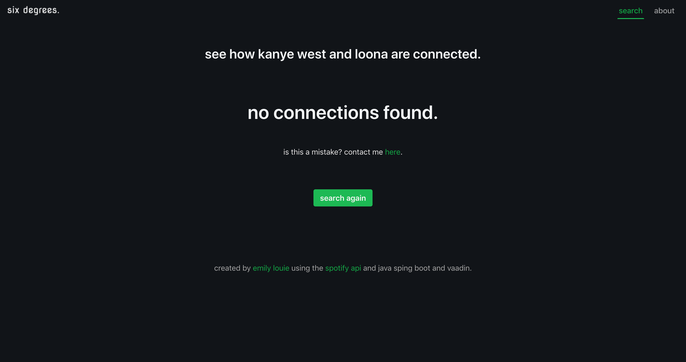
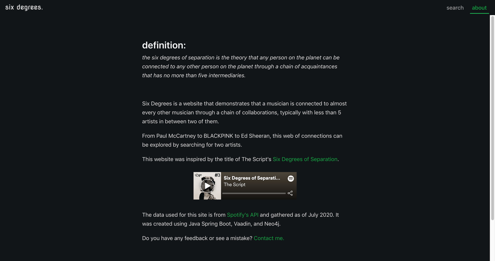

# Six Degrees of Spotify



> A website that draws the connections between two musical artists to show that they connect within 6 collaboration songs

Six Degrees is a website that demonstrates that a musician is connected to almost every other musician through a chain of collaborations, typically with less than 5 artists in between two of them. From Paul McCartney to BLACKPINK to Ed Sheeran, this web of connections can be explored by searching for two artists. This website was inspired by the title of The Script's [Six Degrees of Separation](https://open.spotify.com/track/0Sayb1EWTywPttwJo7zjBt?si=P14dbX1aQYa5b4QtW3V9gA) song.

The data used for this site is from [Spotify's API](https://developer.spotify.com) and gathered as of July 2020. It was created using Java Spring Boot, the Vaadin UI framework, and a Neo4j graph database.

\*Unfortunately, the Neo4j database requires too much server storage and RAM to run properly using free services. I am currently looking for a solution and hope to find an easy way to run it on the web.

## Quickstart

- Clone the repo
- Run `cd docker-neo4j`
- Run `docker-compose up -d` to start the Neo4j database
- Start the application by running `java -jar spotify-ui/target/spotify-ui-0.0.1-SNAPSHOT.jar`
- Visit the website and search for two artists
- When you're done, run `docker-compose down` to stop the Neo4j database

## Creating the project

### Inspiration

I remember the day I first listened to The Script's [Six Degrees of Separation](https://open.spotify.com/track/0Sayb1EWTywPttwJo7zjBt?si=P14dbX1aQYa5b4QtW3V9gA) song. It reminded me of the formal theory which I had previously investigated. The six degrees of separation theory states that everyone on this earth is separated by no more than six mutual connections. While this theory has been disproven, I was interested in seeing if this theory would continue to be disproven in the music industry. Thus, I began to explore the use of that Spotify API which I noticed allowed me to easily access thousands and thousands of artists and their songs.

A similar concept has also been done by Sunny Amrat's [Six Degrees of Kanye West](sixdegreesofkanyewest.com) (Github: https://github.com/sa2812/Six-Degrees-of-Kanye-West) which was built in Python and finds if an artist is within six or less collaboration songs with Kanye. I wanted to expand on this notion to create a more versatile application allowing the user to search between _any_ two artists rather than just Kanye West and another. Thus, in terms of technicality, I knew this would be feasible since I could collect the artists from the API and map relationships between them to calculate the degrees of separation between two artists, this would just need to be a much larger database than the one Sunny used.

### Goal

> How might we empower people to find the collaboration songs between their favourite artists?

Originally, I thought it would interesting to show a data visualization that graphs the connections between artists based on collaboration songs in a web format. However, due to how large the visualization might be, I opted for narrowing the problem:

> How might we help people find the path of collaboration songs between two artists?

For me, this was a interesting problem to try and solve. As someone who listens to a lot of different music in different genres, I thought it would be interesting to see how the artists might be related, if at all. This also opens up some opportunities that I could explore in a future project, such as helping to create a seamless playlist between two artists even if they span across different genres.

### Designing the interface

Being the designer that I am, I created mockups of what I wanted the website to look like. I know I wanted to make this mobile friendly, so the I opted for a more vertical layout to display the site. I also used a simple layout since I wanted the user interaction to focus on the searching of two artists to find the connections between them. Thus, I surfaced the search feature to the home page rather than the search being on a separate page. As such, I gave a brief introduction to what can be done using the website, and then two search fields with a call to action button to allow the user to immediately search.

<p float="left">
  
   
</p>

With this setup, the user does not require very complex instructions as there are very few things going on. It also makes it fairly self explanatory and easy to use.

After the search is made, there are a few states the user can end up in:

1. Both artists are found in the database, and there is a path between them
2. Both artists are found in the database, and there is no path found between them
3. One or both of the artists are not found in the database

If scenario 1 occurs, the user will see a vertical layout displaying the name of the first artist on the collaboration song, followed by the Spotify embed of the collboration song, and the second artist underneath it. This pattern continues until the second artist from the initial search parameter is found.



If scenario 2 or 3 occurs, I simplified the experience and made the content simply say "no connections found" to encompass both scenarios.



### Exploring technologies

Starting off, I thought I could complete the query using only a breadth first search that would stop after 7 layers. While I knew this theoretically should work, practically, it was not feasible due to the amount of time it takes to request from the Spotify API and process the results. (Trust me, I tried...)

Thus, I needed to pivot and create a more hefty application. I knew there was going to be 3 main parts of the application:

1. Pinging the Spotify API and storing the artists and their songs in a database for easy searching
2. Querying the artists requested by the user and finding the path of collaborations between them
3. Creating the user interface and handling the user's interactions

Because I wanted to further explore the use of Java and Spring, I used it as the base of my application. I've used Java for awhile and am familiar with it and Sping has many capabilities that make it easy to connect to databases and frontend frameworks.

Initially, I used PostgreSQL to store each artist and their songs with collaborators. Theoretically, using an SQL query to join the table to find the correct path between two artists should be possible. However, practically, this proved once again to not be feasible due to the amount of time it takes (~18 minutes) to successfully locate the correct path.

Instead, I chose to use a graph database, Neo4j, to store the artists and their songs. This made it easy to look up artists and find the path between them (less than 1 second)! Having not used a graph database before, it was a little difficult getting everything set up, but it was very cool to try out since Neo4j comes with a way to easily visualize the connections in the database.



If you zoom in, you can see the different artists and some of the songs that might have played with someone else.

Also, Neo4j makes it really easy to query for the path between two artists as mentioned before. This can be done using the Cypher code snippet below and almost instantly returns a result:

```
MATCH p=shortestPath((start:Artist {spotifyId:$spotifyId}-[*]-(end:Artist {spotifyId:$spotifyId2})) RETURN p)
```

After ensuring all of this worked in the console, I then began to store all of the artists and their songs with collaborations by pinging the Spotify API.

Then, I developed the user interface using Vaadin, a Java UI framework. I had never used it before, but it was interesting to learn and made me appreciate how Vaadin makes it easy for backend developers to create frontend interfaces. It also made me appreciate frontend frameworks like React more due to the ease in customizability that it has for UIs over Vaadin.

### Challenges

One of the challenges of using the Spotify API was not the API itself, but the mass amounts of data that the Spotify API can return. Originally, I thought it would be possible to clone most, if not all, of Spotify's information on songs with collaborators, however, I quickly realized how long this process was taking and the size of my database. I underestimated the amount of items on Spotify. Thus, I chose to focus on the more popular songs only include those since that would satisfy 80% of users.

I also ran into the issue where I was using the wrong type of database to house my project. Initially, I thought a SQL database would make sense since there are queries that exist for the six-degrees-type query. However, upon trying it, performance-wise, it was unfeasible and not a good user experience. Thus, I switched to a graph database which helped make the query a lot easier and faster.

The user interface did not feel cohesive and was generic. Thus, I chose to change the colour palette to match Spotify's colour scheme. This included a dark mode with green accents. This helped to make my application match and correlate better with Spotify.

Lastly, I faced problems trying to host the application online for free. Needing to run my Neo4j database and serve the UI, there were not many options that had enough computing power to serve it onto the web. After trying both Google Cloud Platform and Heroku (and numerous other options), I could not find a way to host the app for free.

## Final result









## Future roadmap

There are numerous ways I can further improve Six Degrees of Spotify. Below are improvements ordered by priority:

1. As a user, I want to try the application without cloning the git repository. (hosting)

   My first prioritization is hosting the project so that I can share the application and have others try it out! Currently, there is no feasible way to host the project for free, but I will continue looking.

2. New music comes out frequently, as a user, I want to see the latest collaboration songs appear when I search for certain connections. (staying up to date)

   My next prioritization is to ensure the database of songs and collaborations stays up to date since my database is only current as of July 2020. This ensures that when someone searches up an artist with a new collaboration song, the song is recognized as a linker and may help to connect two artists if they were not connected before.

   One way to do this is to automate a process once-a-week to fetch new songs from the Spotify API via the weekly hot playlists which often feature new music. This way the database stays up to date with music that 80% of people will search for.

3. As a user, I want to create a playlist that has smooth transitions between two of my favourite artists using the collaboration songs between them. (feature)

   Similar to [Boil the Frog](http://boilthefrog.playlistmachinery.com) but using collaboration songs instead of artist similarity, this feature would allow the user to create a seamless playlist between two artists based on collaboration songs and other songs to help fill up the playlist. This would be relatively simple to do given the data I have collected and the fact that the Spotify API allows developers to create and save playlists to user accounts after authentication.

4. As a user, I want to see the path between the two artists I initially searched for, as well as see any other collaborators they may have. (feature)

   Similar to [Spotify Artist Explore](https://artist-explorer.glitch.me) but using collaboration songs instead, this feature would allow a user to search for two artists, show that initial connection through collaborations, and then also show any other collaborations with other artists in a web format. This could allow for exploration of similar artists up to 2 or 3 degrees rather than simply a linear path. To implement this, I would likely use a data visualization library like d3 to simplify the process.

## Licence

[Apache Licence 2.0](https://github.com/emilyslouie/six-degrees/blob/master/LICENSE)
